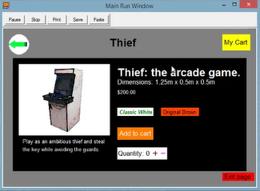

# turing-arcade-shop-with-games
My ICS2O culminating project. It is made to simulate an e-commerce page selling arcade games. Includes four functional games: Snake, a custom platformer, an endless runner, and a Space Shooter. To run it, run main.t 

